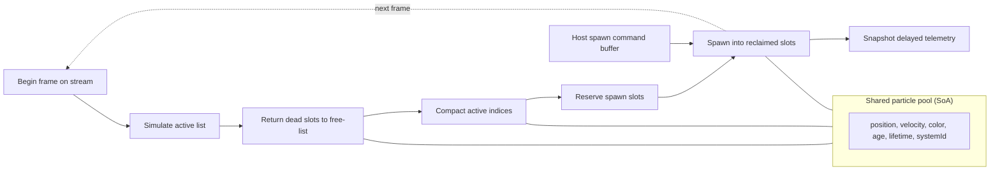

# GPU Simulation Architecture

## Scope

VParticles is currently a compute-only GPU particle simulation engine for game VFX such as fire, smoke, sparks, trails, and bursts. Rendering, Blender integration, editor tooling, and external protocols are intentionally out of scope until the simulation core is fast and stable.

The first production compute backend is CUDA. The architecture should keep CUDA details contained so future backend work does not require rewriting the particle model.

## Performance Model

At 10M+ particles, the engine is expected to be bandwidth-bound more often than compute-bound. The core design question is therefore not "how fast is one particle update?" but "how few full-pool passes and memory transfers can the frame perform?"

Primary rules:

- Prefer one global dispatch per stage over one dispatch per effect.
- Prefer structure-of-arrays over array-of-structures.
- Fuse force, integration, age, color, and size work where practical.
- Avoid CPU readback in the hot path; use delayed telemetry or explicit validation boundaries.
- Profile lifecycle management early because compaction can become the largest full-pool pass.

## Frame Pipeline



Emitters live on the host and produce one compact spawn-command buffer each frame. A single spawn kernel resolves the commands, so the number of GPU launches does not grow with the number of emitters. Each frame first retires particles, then spawns into the slots just returned to the device free-list. That avoids artificial spawn drops when an effect is at capacity but particles expire in the same update.

Frame-control counters remain on the GPU. Host-visible stats are delivered through a small delayed telemetry ring, and `ParticleSystem::synchronize()` is reserved for explicit reporting, tests, and debugging.

## Shared Particle Pool

The engine uses one global particle pool shared by all active effects. Each live particle carries a `systemId` that identifies the owning emitter/effect recipe.

This avoids hundreds of tiny buffers and repeated kernel launches when many effects are alive at once. The cost is possible warp divergence if different particle recipes are interleaved. Grouping live particles by `systemId` during compaction mitigates that.

Initial FP32 pool:

```cpp
struct ParticlePool {
    float4* pos;
    float4* vel;
    float4* color;
    float* age;
    float* lifetime;
    uint32_t* systemId;
    uint32_t* activeIndices;
    uint32_t capacity;
    uint32_t aliveCount;
};
```

`ParticlePool::aliveCount` and `ParticlePool::activeIndices` are completed host telemetry snapshots. CUDA consumers that need the current active list should use `GpuParticlePool`, whose active-list pointer and active count reference GPU-resident frame state.

Rough FP32 budget for position, velocity, color, age, lifetime, and system id is about 60 to 70 bytes per particle. At 10M particles, the core attributes are roughly 600 to 700 MB before optional attributes, scratch buffers, and future rendering resources.

## Lifecycle Management

### Active Indices And Persistent Free-List

Particle attributes remain in stable SoA slots. A dense active-index list drives the simulation kernel, while a device free-list owns vacant slots.

- death pushes a slot index onto the free-list
- spawn pops a slot index and appends it to the active-index list
- the simulation kernel writes alive flags for the active list it processed
- a CUB block-scan compaction kernel writes surviving `uint32_t` active indices into the scratch list
- a finalizer swaps active-list buffers only when deaths occurred
- death-free frames return quickly from compaction without CPU involvement

This prevents a lifecycle pass from gathering every particle attribute. The tradeoff is that a long-running free-list can reduce SoA locality. Locality repair and grouping are therefore benchmarked GPU-side sort/group strategies, not unconditional work in the hot path.

### Future Grouping

Use CUB radix sort when live particles also need to be grouped by `systemId`. The sort key can combine alive/dead state and system grouping:

```text
key = deadFlag << 31 | systemId
```

Grouping will initially reorder active indices only. A dense SoA rebuild is a separate strategy to benchmark when simulation locality becomes more important than sparse lifecycle cost.

## Kernel Strategy

Start with a small fixed set of hand-written kernels:

- spawn
- simulate
- compact active indices
- optional group/sort
- delayed telemetry snapshot

The simulation kernel should fuse common modules:

- age update
- lifetime kill flag
- gravity
- drag
- wind
- turbulence
- simple collision
- position integration
- color/size-over-life sampling

Every separate full-pool pass costs global memory bandwidth. Extra arithmetic inside one fused pass is usually cheaper than another read/write pass.

## Randomness

Spawn randomness should avoid persistent `curandState` arrays at this scale. Prefer counter-based generation where each random value is derived from stable identifiers such as:

```text
global seed
frame index
particle id or spawn index
emitter/system id
```

Philox-style generation is a good fit because it is deterministic, parallel-friendly, and does not require storing RNG state per particle.

## Packed State Road

The FP32 pool is the correctness and profiling baseline. Packed formats come later.

Candidate packed state:

```text
position: tile-local quantized int16/int32
velocity: fp16 or signed normalized 16-bit
age/lifetime: normalized uint16
color: rgba8
radius/size: fp16 or normalized uint16
flags: uint8/uint16
```

Packed kernels should decode into FP32 registers, simulate in FP32, then encode back to compact storage. This reduces memory bandwidth while keeping computation stable.

## CUDA Graphs

Once the frame sequence stabilizes, capture the update pipeline with CUDA Graphs:

```text
begin -> simulate -> compact/group -> reserve/spawn -> telemetry
```

Replay graphs for normal frames to reduce CPU launch overhead. Rebuild only when pipeline structure changes.

## Future Data-Driven Effects

Fixed kernels are the right first step. When designer-facing module composition matters, add NVRTC:

- compose effect recipe into CUDA source
- compile at effect load time
- cache compiled kernels
- dispatch grouped particle ranges by recipe/system

This should come after the built-in modules prove the data model.

## Rendering Later

For now, use plain `cudaMalloc` buffers and raw device pointers. Future renderer interop can supply the same pointer style:

- OpenGL: `cudaGraphicsGLRegisterBuffer`
- Vulkan: external memory and external semaphores

The simulation kernels should not care which renderer eventually consumes the data.
