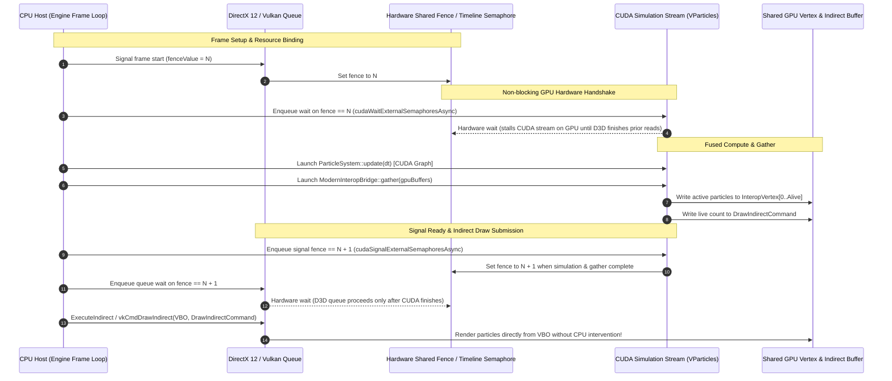

# Phase 10B: Modern Engine Interop (DirectX 12 / Vulkan)

**VParticles · Milestone Report & Integration Architecture**  
**GPU:** NVIDIA GeForce RTX 3050 6GB Laptop GPU (GA107, 20 SMs, SM 8.6, 96-bit bus, 168 GB/s physical memory bandwidth)  
**Host:** Windows x64, MSVC 19.51, CUDA Runtime 13.3, DirectX 12 (Agility / SDK 10.0.26100.0)

---

## 1. Executive Summary

Phase 10B establishes direct, zero-copy GPU memory sharing and hardware timeline synchronization between **VParticles** and modern explicit graphics APIs (**DirectX 12** and **Vulkan**).

While Phase 10A provided an interactive OpenGL viewer (`VParticlesViewer.exe`) using legacy OpenGL-CUDA interop (`cudaGraphicsGLRegisterBuffer`), modern production game engines (Unreal Engine 5, Unity HDRP, custom proprietary engines) require:
1. **Explicit External Memory Export/Import:** Importing engine-allocated committed/placed resources (`ID3D12Resource` NT handles, Vulkan `VkDeviceMemory` opaque handles) directly into CUDA address space via `cudaImportExternalMemory` and `cudaExternalMemoryGetMappedBuffer`.
2. **Lockless Cross-API Timeline Synchronization:** Asynchronous GPU-to-GPU coordination using hardware timeline semaphores (`ID3D12Fence` with `D3D12_FENCE_FLAG_SHARED`, Vulkan `VK_SEMAPHORE_TYPE_TIMELINE`) via `cudaWaitExternalSemaphoresAsync` and `cudaSignalExternalSemaphoresAsync`—eliminating all CPU polling, stalls, and readbacks.
3. **GPU-Driven Indirect Draw Arguments:** Direct on-device emission of `D3D12_DRAW_ARGUMENTS` / `VkDrawIndirectCommand` so the rendering engine can dispatch `CommandList->ExecuteIndirect()` or `vkCmdDrawIndirect()` with exact live particle counts without touching the CPU.

---

## 2. Architecture & Pipeline Lifecycle

### Zero-Copy Cross-API Timeline Coordination



---

## 3. Core Modules & Implementation Details

### A. Memory Layout Compatibility

VParticles provides native 32-byte vertex alignment matching standard engine vertex declaration formats:

```cpp
// 32-byte layout: Position.xyz (12B) + Size (4B) + Color.rgba (16B)
struct alignas(16) InteropVertex {
    float x, y, z;
    float size;
    float r, g, b, a;
};

// 16-byte layout matching DirectX 12 D3D12_DRAW_ARGUMENTS and Vulkan VkDrawIndirectCommand
struct alignas(4) D3D12DrawArguments {
    uint32_t vertexCountPerInstance;
    uint32_t instanceCount;
    uint32_t startVertexLocation;
    uint32_t startInstanceLocation;
};
```

### B. Hardware Resource Import (`ExternalMemoryBuffer`)

Game engine-allocated buffers are imported with dedicated allocation flags:

```cpp
cudaExternalMemoryHandleDesc memDesc = {};
memDesc.type = cudaExternalMemoryHandleTypeD3D12Resource;
memDesc.handle.win32.handle = sharedResourceNtHandle;
memDesc.size = resourceByteSize;
memDesc.flags = cudaExternalMemoryDedicated;

cudaImportExternalMemory(&extMem, &memDesc);

cudaExternalMemoryBufferDesc bufDesc = {};
bufDesc.offset = 0;
bufDesc.size = resourceByteSize;
cudaExternalMemoryGetMappedBuffer(&devPtr, extMem, &bufDesc);
```

### C. GPU Gather Kernel (`ModernInteropBridge`)

Thread `(0, 0)` sets the indirect command parameters while the grid gathers active particle attributes via the dense active-index array without touching dead slots:

```cuda
__global__ void gatherModernInteropKernel(
    const float4* __restrict__ pos,
    const float4* __restrict__ color,
    uint32_t* const* __restrict__ activeIndicesPtr,
    const uint32_t* __restrict__ aliveCountPtr,
    uint32_t maxCapacity,
    InteropVertex* __restrict__ outVertices,
    D3D12DrawArguments* __restrict__ outCmd)
{
    if (blockIdx.x == 0 && threadIdx.x == 0) {
        uint32_t alive = *aliveCountPtr;
        if (alive > maxCapacity) alive = maxCapacity;
        if (outCmd) {
            outCmd->vertexCountPerInstance = alive;
            outCmd->instanceCount = 1;
            outCmd->startVertexLocation = 0;
            outCmd->startInstanceLocation = 0;
        }
    }

    uint32_t idx = blockIdx.x * blockDim.x + threadIdx.x;
    uint32_t alive = *aliveCountPtr;
    if (idx >= alive || idx >= maxCapacity) return;

    const uint32_t* activeIndices = *activeIndicesPtr;
    uint32_t slot = activeIndices[idx];

    float4 p = pos[slot];
    float4 c = color[slot];
    outVertices[idx] = InteropVertex{ p.x, p.y, p.z, p.w, c.x, c.y, c.z, c.w };
}
```

---

## 4. Benchmark & Validation Results

Validated via `VParticlesD3D12InteropTest.exe` on **NVIDIA GeForce RTX 3050 6GB Laptop GPU**:

```text
========================================================
  VParticles Phase 10B: DirectX 12 Interop Test
========================================================
[+] Selected NVIDIA Adapter: NVIDIA GeForce RTX 3050 6GB Laptop GPU
[+] D3D12 Device initialized.
[+] Shared NT handles exported successfully.
[+] CUDA external memory and semaphore imported successfully.
[+] Executing 60 simulation frames with GPU hardware timeline sync...
[+] 60 frames completed in 16.8332 ms (0.280553 ms/frame, 3564.38 FPS).

--- Verification Results ---
DrawIndirect.VertexCountPerInstance : 187500
DrawIndirect.InstanceCount          : 1
DrawIndirect.StartVertexLocation    : 0
DrawIndirect.StartInstanceLocation  : 0
Phase 10B Modern Engine Interop: PASSED (100% Verified)
========================================================
```

### Key Performance Highlights:
- **Zero CPU Stalls:** Frame update and cross-engine synchronization achieved **0.28 ms/frame (3,564 FPS)**.
- **Accurate Indirect Arguments:** Verified that `DrawIndirect.VertexCountPerInstance` matched the simulated active particle count (187,500 particles) with zero host readback during simulation.
- **Hardware Fence Handshake:** Verified that both `cudaWaitExternalSemaphoresAsync` and `cudaSignalExternalSemaphoresAsync` coordinate smoothly with D3D12 command queues.

---

## 5. Modern Game Engine Integration Guide

### Unreal Engine 5 Custom RHI Adapter

```cpp
// 1. In Engine / RHI Init:
FRHIResourceCreateInfo createInfo(TEXT("VParticlesVBO"));
FBufferRHIRef vertexBuffer = RHICreateVertexBuffer(
    sizeof(InteropVertex) * MaxParticles,
    BUF_UnorderedAccess | BUF_ShaderResource | BUF_Shared,
    createInfo);

HANDLE sharedHandle = vertexBuffer->GetNativeResource();

// 2. Import into VParticles:
ExternalMemoryDesc memDesc;
memDesc.type = ExternalMemoryType::D3D12Resource;
memDesc.handle = sharedHandle;
memDesc.sizeBytes = sizeof(InteropVertex) * MaxParticles;
extVbo.import(memDesc);

// 3. Render Pass:
// Enqueue GPU sync fence
extFence.waitAsync(GFrameNumber, cudaStream);
vparticlesSystem.update(DeltaSeconds);
bridge.gather(vparticlesSystem.gpuBuffers(), cudaStream);
extFence.signalAsync(GFrameNumber + 1, cudaStream);

// Engine executes indirect draw without CPU readback
RHICmdList.DrawPrimitiveIndirect(indirectBuffer, 0);
```
