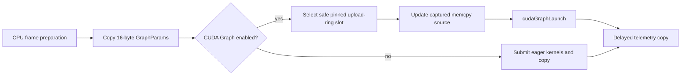
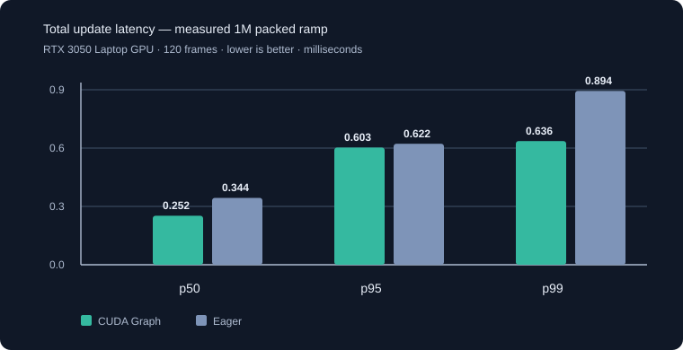
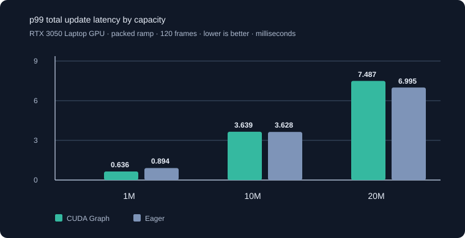

# Phase 8: CUDA Graph Launch Overhead Reduction

**Status:** Implemented and validated at 1M, 10M, and 20M packed particles  
**Updated:** 2026-09-27

## Executive summary

Phase 8 replaces the steady-state update submission sequence with a CUDA Graph. The graph captures frame initialization, simulation, compaction, batched spawn upload, spawning, and optional tile migration; steady-state frames submit that sequence with one `cudaGraphLaunch` call.

The implementation keeps the public `ParticleSystem::update()` contract asynchronous. It does not add a per-frame GPU wait, and it preserves `--no-graph` as an eager-submission A/B baseline. Graph timing is deliberately reported as aggregate pipeline time: CUDA timing events outside a graph cannot recover meaningful per-stage durations from inside the graph.

## Submission model



The captured sequence retains the spawn-command H→D transfer inside the graph. Each replay selects a completed pinned-ring slot and updates only the memcpy node’s source address. This prevents the CPU from rewriting a source buffer that an earlier graph launch may still read, while avoiding a separate spawn-copy submission outside the graph.

Per-frame values (`requestedSpawn`, `frameIndex`, simulation time, and `dt`) live in a small device-side `GraphParams` buffer. This allows the same graph executable to replay with new frame data without changing kernel node parameters.

## Rebuild policy and observability

The graph is rebuilt only when the captured work topology changes:

- simulation, spawn, or migration grid dimensions;
- spawn-command count;
- simulation settings or emitter storage that changes captured device pointers.

`SimulationStats` exposes `graphActive` and `graphRebuildCount`. The benchmark prints `[graph]` or `[eager]` in its header and supports `--no-graph` for a direct comparison. CSV output includes the submission mode and rebuild count.

When `graphActive` is true, `totalMs` is the timing contract and `simulateMs` mirrors that aggregate value. `compactMs` and `spawnMs` are set to zero rather than misrepresenting the complete graph duration as separate stages.

## Measured A/B result

These are reproducible measurements, not hardware-independent claims. They compare total update latency on the project’s RTX 3050 Laptop GPU; each pair uses the same build, packed ramp workload, frame count, and timestep.



| 1M metric | CUDA Graph | Eager | Change |
|---|---:|---:|---:|
| Total p50 | 0.252 ms | 0.344 ms | 26.7% lower |
| Total p95 | 0.603 ms | 0.622 ms | 3.1% lower |
| Total p99 | 0.636 ms | 0.894 ms | 28.9% lower |
| Final alive count | 999,999 | 999,999 | Exact match |

The broader p99 comparison is included to make the trade-off visible. On this run, graph replay improved the 1M tail, but it did not improve the sampled 10M or 20M tail. These values should be treated as an initial implementation baseline, not a marketing claim.



| Capacity | Graph p50 | Eager p50 | Graph p95 | Eager p95 | Graph p99 | Eager p99 | Final alive (both) | Rebuilds |
|---:|---:|---:|---:|---:|---:|---:|---:|---:|
| 1M | 0.252 ms | 0.344 ms | 0.603 ms | 0.622 ms | 0.636 ms | 0.894 ms | 999,999 | 6 |
| 10M | 0.427 ms | 0.689 ms | 2.290 ms | 2.047 ms | 3.639 ms | 3.628 ms | 9,999,999 | 2 |
| 20M | 0.638 ms | 0.859 ms | 4.035 ms | 3.426 ms | 7.487 ms | 6.995 ms | 19,999,999 | 2 |

Commands used:

```powershell
.\out\build\x64-Release\VParticles.exe --capacity 1000000 --frames 120 --packed --csv phase8_graph_1m.csv
.\out\build\x64-Release\VParticles.exe --capacity 1000000 --frames 120 --packed --no-graph --csv phase8_eager_1m.csv
```

The p50 reduction is consistent across these three ramp samples, but p95/p99 are not. The workload is still largely memory-bandwidth-bound, so a launch-reduction feature cannot be assumed to dominate every latency percentile. Run the full matrix on the target machine before using these numbers for capacity planning or release claims.

## Validation checklist

- Correctness: graph and eager smoke runs produced the same final live count (99,999) at 100K packed particles over 60 frames.
- A/B parity: graph and eager packed runs produced the same final live counts at 1M (999,999), 10M (9,999,999), and 20M (19,999,999) over 120 frames.
- Lifecycle safety: captured upload sources rotate through the pinned ring and are released only after their recorded completion event.
- Fallback: `--no-graph` exercises the conventional eager path with the same device-parameter semantics.

## Reproducing the full matrix

```powershell
.\out\build\x64-Release\VParticles.exe --matrix --matrix-capacities 1000000,5000000,10000000,20000000 --matrix-emitters 1,8,64 --packed --frames 120 --csv phase8_graph_matrix.csv
.\out\build\x64-Release\VParticles.exe --matrix --matrix-capacities 1000000,5000000,10000000,20000000 --matrix-emitters 1,8,64 --packed --frames 120 --no-graph --csv phase8_eager_matrix.csv
```

Compare `totalP50`, `totalP95`, `totalP99`, final lifecycle counts, and `graphRebuilds`. Use matching clock, power, driver, and background-load conditions for a defensible comparison.
