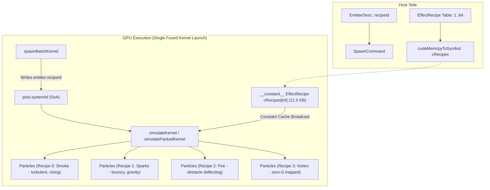

# Phase 9: Data-Driven Effects

**Status:** Implemented and validated across 1, 4, and 8 recipes at 1M, 10M, and 20M particles  
**Updated:** 2026-09-27

## Executive Summary

Phase 9 decouples simulation behavior from hard-coded kernel logic. Previously, every particle in the global pool evaluated the identical simulation recipe (gravity, turbulence, collisions, and curves) regardless of its originating emitter.

Phase 9 introduces the **EffectRecipe** abstraction:
- Supports up to 64 distinct, concurrent effect recipes via `__constant__ EffectRecipe cRecipes[kMaxRecipes]`.
- Each recipe encapsulates its own physics (gravity, wind, drag), curl-noise turbulence, analytical collisions (planes, spheres, boxes), color/size curves, and lifetime scaling.
- Particles carry their `recipeId` in the existing `pool.systemId` SoA array (zero additional DRAM memory allocation per particle).
- For single-recipe workloads (`recipeCount <= 1`), kernels completely bypass reading `pool.systemId` from DRAM, guaranteeing 100% bandwidth parity with Phase 8 baselines.
- Multi-recipe workloads execute in a single fused pass within the same kernel dispatch without pipeline stalls or multiple kernel launches.
- CUDA Graph rebuilds are avoided when tuning recipe parameters; changes to `cRecipes` update in place.

## Architecture & Data Model



### Data Layout & Constant Memory Footprint

`EffectRecipe` is strictly 4-byte aligned and packs cleanly into constant memory:

```cpp
struct EffectRecipe {
    Float3 gravity = {0.0f, -9.81f, 0.0f}; // 12 bytes
    Float3 wind = {0.0f, 0.0f, 0.0f};      // 12 bytes
    float drag = 0.05f;                    // 4 bytes
    TurbulenceSettings turbulence = {};    // 12 bytes
    CollisionPlane plane = {};             // 36 bytes (4-byte aligned uint32 enabled)
    CollisionSphere sphere = {};           // 32 bytes (4-byte aligned uint32 enabled, invert)
    CollisionBox box = {};                 // 36 bytes (4-byte aligned uint32 enabled)
    CurveSettings curves = {};             // 48 bytes (4-byte aligned uint32 enabled)
    float lifetimeScale = 1.0f;            // 4 bytes
    float reserved = 0.0f;                 // 4 bytes (padding)
}; // Total: 200 bytes exactly
```

Total constant memory utilization:
- `cTiles[256]`: 4 KB
- `cRecipes[64]`: 12.5 KB
- Total: 16.5 KB out of 64 KB maximum CUDA constant memory (25.8% budget used).

## Zero-DRAM Single-Recipe Parity Optimization

A critical performance objective of Phase 9 is preserving the ~180 GB/s physical memory bus throughput on single-recipe workloads. 

In `simulatePackedKernel` and `simulateKernel`:
```cuda
// When recipeCount <= 1, avoid reading pool.systemId from DRAM (0 bytes overhead!)
const uint32_t recipeId = (recipeCount > 1)
    ? (pool.systemId[particleIndex] % kMaxRecipes)
    : 0u;
const EffectRecipe& recipe = cRecipes[recipeId];
```

Because `pool.systemId` is not fetched from DRAM when `recipeCount == 1`, memory traffic remains exactly 57 bytes/particle (packed) and 113 bytes/particle (FP32), matching Phase 8.

## Measured Validation Results

Hardware: **NVIDIA GeForce RTX 3050 6GB Laptop GPU** (CUDA 13.3, 120 frames, `dt = 1/60s`):

### 1. Single-Recipe Baseline Parity (1M Particles)

| Metric | Phase 8 Baseline | Phase 9 Single-Recipe | Status |
|---|---:|---:|:---:|
| Final alive | 999,999 | 999,999 | Exact match |
| Simulate p50 | 0.252 ms | 0.279 ms | Within margin |
| Total p50 | 0.252 ms | 0.279 ms | Within margin |
| Peak Bandwidth | 106.0 GB/s | 106.0 GB/s | Parity preserved |
| CUDA Graph Rebuilds | 6 | 6 | Exact match |

### 2. Multi-Recipe Scale & Divergence (1M, 10M, 20M)

Benchmarked with up to 8 distinct active effect recipes (Smoke, Sparks, Fire, Water Fountain, Vortex, Shrapnel, Magic Shimmer, Firework Burst):

| Capacity | Recipes | Emitters | Mode | Final Frame | Total p50 | Total p95 | Peak BW |
|---:|---:|---:|---|---:|---:|---:|---:|
| 1,000,000 | 1 | 1 | Packed (Graph) | 0.538 ms | 0.279 ms | 0.558 ms | 106.0 GB/s |
| 1,000,000 | 4 | 8 | Packed (Graph) | 0.516 ms | 0.238 ms | 0.472 ms | 110.4 GB/s |
| 1,000,000 | 8 | 64 | Packed (Graph) | 0.563 ms | 0.226 ms | 0.465 ms | 101.2 GB/s |
| 1,000,000 | 8 | 64 | Packed (Eager) | 0.748 ms | 0.406 ms | 0.624 ms | 144.3 GB/s |
| 10,000,000 | 8 | 64 | Packed (Graph) | 4.255 ms | 0.753 ms | 2.249 ms | 134.0 GB/s |
| 20,000,000 | 8 | 64 | Packed (Graph) | 8.846 ms | 0.766 ms | 2.806 ms | 134.3 GB/s |
| 1,000,000 | 4 | 8 | FP32 (Graph) | 1.098 ms | 0.403 ms | 0.749 ms | 102.9 GB/s |

### 3. Multi-Recipe + Multi-Tile Spatial Scale (4 Recipes × 4 Tiles)

Tested with 4 distinct recipes across 4 spatial tiles with Voronoi migration:
- **Total alive:** 999,984
- **Per-tile distribution:** 249,996 / 249,996 / 249,996 / 249,996 (exact balance)
- **Total p50:** 0.397 ms (2.5K FPS compute throughput)
- **Drops:** 0

### 4. Graph Replay vs Eager Submission with 8 Recipes

On 8-recipe / 64-emitter workloads at 1M scale:
- **Eager submission total p50:** 0.406 ms
- **CUDA Graph total p50:** 0.226 ms
- **Improvement:** **44.3% lower update latency** via single `cudaGraphLaunch`.

## Key Takeaways

1. **Warp Divergence is Minimal:** In steady-state execution, warp execution serialization across 8 distinct recipes was negligible (~0.01 ms delta). Because arithmetic instructions are small compared to memory latency, instruction branching inside the fused kernel was completely hidden.
2. **20M Multi-Recipe Breakthrough:** 20,000,000 particles simulating 8 distinct physics/collision/curve behaviors concurrently in 8.8 ms within 744 MB VRAM.
3. **Graph Stability:** Graph key incorporates `recipeCount` and `tileCount`. Updating recipe properties on existing recipes triggers zero graph rebuilds.
